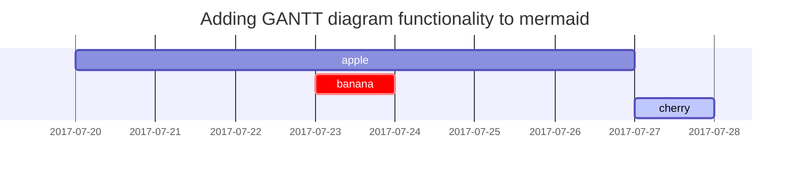

This post is to show Markdown syntax rendering on [**Chirpy**](https://github.com/cotes2020/jekyll-theme-chirpy/fork), you can also use it as an example of writing. Now, let's start looking at text and typography.

## Headings

<h1 class="mt-5">H1 - heading</h1>

<h2 data-toc-skip>H2 - heading</h2>

<h3 data-toc-skip>H3 - heading</h3>

<h4>H4 - heading</h4>

## Paragraph

Quisque egestas convallis ipsum, ut sollicitudin risus tincidunt a. Maecenas interdum malesuada egestas. Duis consectetur porta risus, sit amet vulputate urna facilisis ac. Phasellus semper dui non purus ultrices sodales. Aliquam ante lorem, ornare a feugiat ac, finibus nec mauris. Vivamus ut tristique nisi. Sed vel leo vulputate, efficitur risus non, posuere mi. Nullam tincidunt bibendum rutrum. Proin commodo ornare sapien. Vivamus interdum diam sed sapien blandit, sit amet aliquam risus mattis. Nullam arcu turpis, mollis quis laoreet at, placerat id nibh. Suspendisse venenatis eros eros.

## Lists

### Ordered list

1. Firstly
2. Secondly
3. Thirdly

### Unordered list

- Chapter
  + Section
    * Paragraph

### ToDo list

- [ ] Job
  + [x] Step 1
  + [x] Step 2
  + [ ] Step 3

### Description list

Sun
: the star around which the earth orbits

Moon
: the natural satellite of the earth, visible by reflected light from the sun

## Block Quote

> This line shows the _block quote_.

## Prompts

> An example showing the `tip` type prompt.
{: .prompt-tip }

> An example showing the `info` type prompt.
{: .prompt-info }

> An example showing the `warning` type prompt.
{: .prompt-warning }

> An example showing the `danger` type prompt.
{: .prompt-danger }

## Tables

| Company                      | Contact          | Country |
|:-----------------------------|:-----------------|--------:|
| Alfreds Futterkiste          | Maria Anders     | Germany |
| Island Trading               | Helen Bennett    | UK      |
| Magazzini Alimentari Riuniti | Giovanni Rovelli | Italy   |

## Links

<http://127.0.0.1:4000>

## Footnote

Click the hook will locate the footnote[^footnote], and here is another footnote[^fn-nth-2].

## Inline code

This is an example of `Inline Code`.

## Filepath

Here is the `/path/to/the/file.extend`{: .filepath}.

## Code blocks

### Common

```
This is a common code snippet, without syntax highlight and line number.
```

### Specific Language

```bash
if [ $? -ne 0 ]; then
  echo "The command was not successful.";
  #do the needful / exit
fi;
```

### Specific filename

```sass
@import
  "colors/light-typography",
  "colors/dark-typography";
```
{: file='_sass/jekyll-theme-chirpy.scss'}

## Mathematics

The mathematics powered by [**MathJax**](https://www.mathjax.org/):

$$ \sum_{n=1}^\infty 1/n^2 = \frac{\pi^2}{6} $$

When $a \ne 0$, there are two solutions to $ax^2 + bx + c = 0$ and they are

$$ x = {-b \pm \sqrt{b^2-4ac} \over 2a} $$

## Mermaid SVG



## Images

### Default (with caption)

{: width="972" height="589" }
_Full screen width and center alignment_

### Left aligned

{: width="972" height="589" .w-75 .normal}

### Float to left

{: width="972" height="589" .w-50 .left}
Praesent maximus aliquam sapien. Sed vel neque in dolor pulvinar auctor. Maecenas pharetra, sem sit amet interdum posuere, tellus lacus eleifend magna, ac lobortis felis ipsum id sapien. Proin ornare rutrum metus, ac convallis diam volutpat sit amet. Phasellus volutpat, elit sit amet tincidunt mollis, felis mi scelerisque mauris, ut facilisis leo magna accumsan sapien. In rutrum vehicula nisl eget tempor. Nullam maximus ullamcorper libero non maximus. Integer ultricies velit id convallis varius. Praesent eu nisl eu urna finibus ultrices id nec ex. Mauris ac mattis quam. Fusce aliquam est nec sapien bibendum, vitae malesuada ligula condimentum.

### Float to right

{: width="972" height="589" .w-50 .right}
Praesent maximus aliquam sapien. Sed vel neque in dolor pulvinar auctor. Maecenas pharetra, sem sit amet interdum posuere, tellus lacus eleifend magna, ac lobortis felis ipsum id sapien. Proin ornare rutrum metus, ac convallis diam volutpat sit amet. Phasellus volutpat, elit sit amet tincidunt mollis, felis mi scelerisque mauris, ut facilisis leo magna accumsan sapien. In rutrum vehicula nisl eget tempor. Nullam maximus ullamcorper libero non maximus. Integer ultricies velit id convallis varius. Praesent eu nisl eu urna finibus ultrices id nec ex. Mauris ac mattis quam. Fusce aliquam est nec sapien bibendum, vitae malesuada ligula condimentum.

### Dark/Light mode & Shadow

The image below will toggle dark/light mode based on theme preference, notice it has shadows.

{: .light .w-75 .shadow .rounded-10 w='1212' h='668' }
{: .dark .w-75 .shadow .rounded-10 w='1212' h='668' }

## Video



## Reverse Footnote

[^footnote]: The footnote source
[^fn-nth-2]: The 2nd footnote source

# Advanced Markdown Guide

[Slides -> github.com/DavidWells/advanced-markdown](https://github.com/DavidWells/advanced-markdown/)

## Table of Contents
<!-- AUTO-GENERATED-CONTENT:START (TOC:collapse=true&collapseText="Click to expand") -->
<details>
<summary>"Click to expand"</summary>

- [Why markdown?](#why-markdown)
- [Markdown basics](#markdown-basics)
- [Advanced Formatting tips](#advanced-formatting-tips)
  - [`left` alignment](#left-alignment)
  - [`right` alignment](#right-alignment)
  - [`center` alignment example](#center-alignment-example)
  - [`collapse` Sections](#collapse-sections)
  - [`additional links`](#additional-links)
  - [Badges](#badges)
- [Useful packages](#useful-packages)
- [Useful utilities](#useful-utilities)
- [How Serverless uses markdown](#how-serverless-uses-markdown)
  - [DEMO](#demo)
- [Other Markdown Resources](#other-markdown-resources)

</details>
<!-- AUTO-GENERATED-CONTENT:END -->

## Why markdown?

Markdown is a universal doc format that is easy to write and easy to add to a version control system.

- **Open** - Anyone can submit content, fix typos & update anything via pull requests
- **Version control** - Roll back & see the history of any given post
- **No CMS lock in** - We can easily port to any static site generator
- **It's just simple** - No user accounts to manage, no CMS software to upgrade, no plugins to install.

---

## Markdown basics

The basics of markdown can be found [here](https://guides.github.com/features/mastering-markdown/) & [here](https://daringfireball.net/projects/markdown/). Super easy!

### Image with alt & title

```

```

## Advanced Formatting tips

### `left` alignment


This is the code you need to align images to the left:
```

```

---

### `right` alignment


This is the code you need to align images to the right:
```

```

---

### `center` alignment example

<p align="center">
  
</p>

```
<p align="center">
  
</p>
```

---

### Horizontal images no gap

via [comment](https://gist.github.com/DavidWells/7d2e0e1bc78f4ac59a123ddf8b74932d?permalink_comment_id=4536101#gistcomment-4536101)

```html
<p>
    
    
</p>
```

<p>
    
    
</p>

---

### Horizontal images with gap

With `hspace` property you can set horizontal (left and right) padding for an image

```html
<p>
    
    
</p>
```

<p>
    
    
</p>

---

###  Vertical images with gap

We also have a property "vspace", which does what it sounds like, add vertical spacing. But it doesn't seem to work on GitHub, unlike VSCode's buit in markdown viewer. So probably just add a `<p>` tag in between. 

```html
<p>
    
    <p>
    
    <p>
    
</p>
```

<p>
    
    <p>
    
    <p>
    
</p>

---

### Adding video

To add video you need to upload your video file and reference it inline

```
https://user-images.githubusercontent.com/1702215/158075475-c23004ab-827a-45ad-bdba-aee29ac5b582.mp4
```

Example:

https://user-images.githubusercontent.com/1702215/158075475-c23004ab-827a-45ad-bdba-aee29ac5b582.mp4

### light/dark mode images

Tip via this [tweet](https://twitter.com/stefanjudis/status/1465775940034781186). Swap out images based on theme settings

```


```

### Using [footnotes](https://github.blog/changelog/2021-09-30-footnotes-now-supported-in-markdown-fields/)

Here is a simple footnote[^example]. With some additional text after it.

[^example]: Example footnote

```
Here is a simple footnote[^1]. With some additional text after it.

[^1]: My reference.
````

### Strikethru text in markdown

~~text with line through it~~

```
~~text with line through it~~
```

### Tiny text in markdown

Normal text here.

<sup><sub>Tiny text is here. Awwwww its so cuteeeeeeeeeee</sub></sup>

**How?**

```
<sup><sub>Add your tiny text</sub></sup>
```

### Text box

Add a box with contents to markdown

<div align="center">
<table>
<tbody>
<td align="center">
<br>
<sub>This is text in the box. Much wow</sub><br>

</td>
</tbody>
</table>
</div>

```
<div align="center">
<table>
<tbody>
<td align="center">
<br>
<sub>This is text in the box. Much wow</sub><br>

</td>
</tbody>
</table>
</div>
```

### `collapse` Sections

Collapsing large blocks of text can make your markdown much easier to digest

<details>
<summary>"Click to expand"</summary>
this is hidden block
</details>

```
<details>
<summary>"Click to expand"</summary>
this is hidden
</details>
```

Collapsing large blocks of Markdown text

<details>
<summary>To make sure markdown is rendered correctly in the collapsed section...</summary>

 1. Put an **empty line** after the `<summary>` block.
 2. *Insert your markdown syntax*
 3. Put an **empty line** before the `</details>` tag
 
</details>

```
<details>
<summary>To make sure markdown is rendered correctly in the collapsed section...</summary>

 1. Put an **empty line** after the `<summary>` block.
 2. *Insert your markdown syntax*
 3. Put an **empty line** before the `</details>` tag
 
</details>
```

---

### Call outs

Add call outs in [markdown](https://github.com/community/community/discussions/16925)

> **Note**
> This is a note

> **Warning**
> This is a warning

```
> **Note**
> This is a note

> **Warning**
> This is a warning
```

### `additional links`

[Website](http://www.serverless.com) • [Email Updates](http://eepurl.com/b8dv4P) • [Gitter](https://gitter.im/serverless/serverless) • [Forum](http://forum.serverless.com) • [Meetups](https://github.com/serverless-meetups/main) • [Twitter](https://twitter.com/goserverless) • [Facebook](https://www.facebook.com/serverless) • [Contact Us](mailto:hello@serverless.com)

```
[Website](http://www.serverless.com) • [Email Updates](http://eepurl.com/b8dv4P) • [Gitter](https://gitter.im/serverless/serverless) • [Forum](http://forum.serverless.com) • [Meetups](https://github.com/serverless-meetups/main) • [Twitter](https://twitter.com/goserverless) • [Facebook](https://www.facebook.com/serverless) • [Contact Us](mailto:hello@serverless.com)
```

---

### Badges

<div align="center">

[](https://github.com/fastify/fastify/actions/workflows/ci.yml)
[](https://github.com/fastify/fastify/actions/workflows/package-manager-ci.yml)
[](https://github.com/fastify/fastify/actions/workflows/website.yml)
[](https://snyk.io/test/github/fastify/fastify)
[](https://coveralls.io/github/fastify/fastify?branch=main)
[](https://standardjs.com/)

</div>

---

### Nice looking file tree

For whatever [reason](https://twitter.com/alexdotjs/status/1421015442286596100) the `graphql` syntax will nicely highlight file trees like below:

```graphql
# Code & components for pages
./src/* 
  ├─ src/assets - # Minified images, fonts, icon files
  ├─ src/components - # Individual smaller components
  ├─ src/fragments - # Larger chunks of a page composed of multiple components
  ├─ src/layouts - # Page layouts used for different types of pages composed of components and fragments
  ├─ src/page - # Custom pages or pages composed of layouts with hardcoded data components, fragments, & layouts
  ├─ src/pages/* - # Next.js file based routing
  │  ├─ _app.js - # next.js app entry point
  │  ├─ _document.js - # next.js document wrapper
  │  ├─ global.css - #  Global CSS styles
  │  └─ Everything else... - # File based routing
  └─ src/utils - # Utility functions used in various places
```

### Using CSS in Readme

Use HTML/CSS in a readme via an SVG! [source](https://github.com/sindresorhus/css-in-readme-like-wat)

<div align="center">
  <br>
  <a href="https://github.com/DavidWells/advanced-markdown/blame/master/svg-with-css.svg">
     
  </a>
  <br>
</div>

The above image is embedded like so:

```html
<div align="center">
  <br/>
  <a href="https://github.com/DavidWells/advanced-markdown/blame/master/svg-with-css.svg">
    
  </a>
  <br/>
</div>
```

---

## Useful packages

1. [gray-matter](https://www.npmjs.com/package/gray-matter)

  YAML front-matter is your friend. You can keep metadata in markdown files

  ```
  title: Serverless Framework Documentation
  description: "Great F'in docs!"
  menuText: Docs
  layout: Doc
  ```

2. [Remark](https://www.npmjs.com/package/remark)

  Useful for rendering markdown in HTML/React

3. [Markdown Magic](https://github.com/DavidWells/markdown-magic)

  - [Repo](https://github.com/DavidWells/markdown-magic)
  - [Plugins](https://github.com/DavidWells/markdown-magic#plugins)
  - Show automatic doc generation. [Example 1](https://github.com/DavidWells/markdown-magic/blob/master/examples/generate-readme.js#L15-L23)   | [Example 2](https://github.com/serverless/examples/blob/master/generate-readme.js#L71-L87)

---

## Useful utilities

1. [Schedule Posts](https://github.com/serverless/post-scheduler) - Post scheduler for static sites

  Show DEMO

2. [Zero friction inline content editing](https://jekyll-anon.surge.sh/gods/2015/02/18/vesta.html)

  Show DEMO

3. [Byword](https://bywordapp.com/) & [Typora](https://typora.io/) - Good Editors

4. [Monodraw](https://monodraw.helftone.com/) - Flow charts for days

6. [Kap](https://getkap.co/) - Make gifs

4. [IDE markdown preview](https://atom.io/packages/markdown-preview)

5. Stuck on WordPress? Try [easy-markdown plugin](https://github.com/DavidWells/easy-markdown)

---

## How Serverless uses markdown

Serverless.com is comprised of 3 separate repositories

- https://github.com/serverless/blog
- https://github.com/serverless/serverless | Shoutout to [Phenomic.io](https://phenomic.io/)
- https://github.com/serverless/site

**Why multiple repos?**

1. We wanted documentation about the framework to live in the serverless github repo for easy access
2. We wanted our blog content to be easily portable to any static site generator separate from the implementation (site)
3. `prebuild` npm script pulls the content together & processes them for site build

A single repo is easier to manage but harder for people to find/edit/PR content.

---

### DEMO

- Site structure
- Serverless build process
- [Validation](https://github.com/serverless/blog/blob/master/.travis.yml#L10)
- [Editing Flow](https://serverless.com/framework/docs/providers/aws/cli-reference/deploy/)
- Github optimizations
  - [Link from top of each doc to live link on site](https://github.com/serverless/serverless/blob/master/docs/providers/aws/events/schedule.md)
  - use markdown magic =) to [auto generate tables](https://github.com/serverless/examples) etc
  - [Hide yaml frontmatter from github folks](https://github.com/serverless/serverless/blame/master/docs/providers/aws/events/schedule.md#L1-L7)
  - consider linking everything to site

## Other Markdown Resources

- [Extended markdown syntax](https://www.markdownguide.org/extended-syntax/)
- [Markdown snippets](https://github.com/markdown-templates/markdown-snippets)
- [Verb](https://www.npmjs.com/package/verb) - Documentation generator for GitHub projects
- [ACSII docs](http://asciidoctor.org/) - Markdown alternative
- [Markdown parser performance comparison](https://github.com/Expensify/App/issues/3983#issue-942245008)
- [Handy markdown templates](https://github.com/G3root/readme-generator/blob/9219c5ee638f3b8ff429c5b514d4d211661ae136/src/data/project-block-list.ts)
